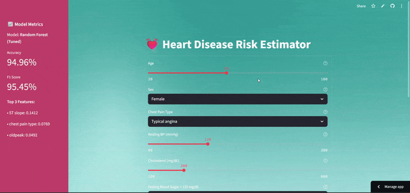

# Detect Heart Disease

A machine learning project that predicts the likelihood of heart disease based on patient health metrics using Python, Pandas, Scikit‑Learn, and TensorFlow/Keras.

---

## 🚀 Features

- Data ingestion & cleaning (handling missing values, encoding categories, normalization).
- Exploratory Data Analysis (EDA) with visualizations (distribution plots, correlation heatmaps, etc.).
- Multiple classifiers implemented and compared, such as:
  - Logistic Regression
  - Decision Tree / Random Forest
  - Support Vector Machine
  - K‑Nearest Neighbors
- The top 3 models were:
   - Random Forest
   - Decision Tree
   - Gradient Boosting
- Hyperparameter tuning (GridSearch, RandomSearch) on top 3 models.
- We used ensemble techniques Voting, Bagging, Stacking Classifier on top 3 individual models.
- Comparative model evaluation using accuracy, f1-score. This was visualized using bar chart.
- The best accuracy and F1 score was achieved by Random Forest Model.
- Save/Load trained model with `joblib` or `pickle`.
- A simple web app for real-time prediction.

---

## 📂 Project Structure

```
/
├── dataset.csv                            # Dataset
├── ML Heart Disease Detection.ipynb       # Model training and evaluation
├── app.py                                 # Flask app for inference
├── best_model.pkl                         # Saved trained model
├── feature_names.pkl                      # Saved features in an order
├── heart.webp                             # Background image for web app
├── permutation_importance.pkl             # Saved permutation_importance function which calculates the feature importance of estimators for a given dataset
├── rf_metrics.json                        # Saved Accuracy and F1 score of random forest
├── scalar.pkl                             # Saved scaler used for standardization
├── requirements.txt
└── README.md
```

---

## Project Demo


---
## 🛠️ Quick Start

1. **Clone repository**
   ```bash
   git clone https://github.com/Hurmath123/Detect-Heart-Disease.git
   cd Detect-Heart-Disease
   ```

2. **Install dependencies**
   ```bash
   pip install -r requirements.txt
   ```

---

## Deploy on Streamlit Cloud

1. Push this repo to your GitHub
2. Go to [https://streamlit.io/cloud](https://streamlit.io/cloud)
3. Click "New App" and select your repo
4. Set `app.py` as the main file
5. Deploy!

---

## 🧠 Data Description

This project uses a modified version of the UCI Heart Disease dataset, containing 303 samples.`

Refer to notebooks or data_processing module for detailed encoding and mapping.
.

---

## 📈 Results & Insights

- **Best performing model**: Random Forest.(Accuracy: 94.96%, F1 Score: 95.45%)
- **Key predictive features**: ST slope, Chest pain Type, oldpeak etc.
- **General observation**: Good balance between sensitivity (recall) and specificity; medical baseline assumptions discussed in notebook.

---

## 🔧 Future Work

- Gather more real patient data for validation.
- Improve feature engineering.
- Deploy as a full-stack web application.
- Explore deeper NN architectures with attention or ensemble methods.

---

## 📄 License

MIT License © [Frough Hurmath S]

---

## 📞 Contributing

Contributions welcome! To contribute:

1. Fork the repo
2. Create a feature branch
3. Submit a pull request with tests and clean code
4. Ensure all CI/tests are passing

---
